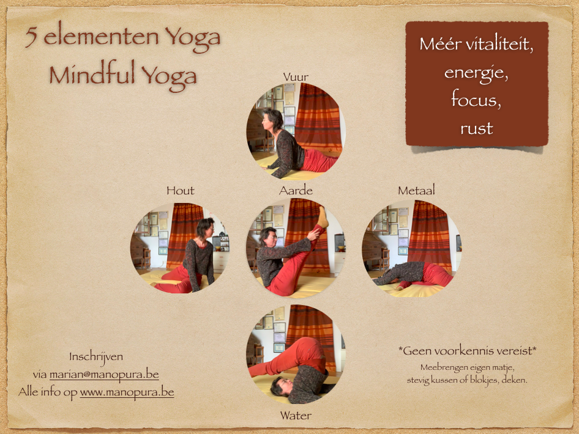

# Cursussen

**Voor data en uren, kijk ook onder Praktisch, Agenda. Of schrijf je in op onze nieuwsbrief, zo blijf je altijd bij!**

**MINDFULNESS**

Stress overheerst je leven, en je wil er wat aan doen. Maar je weet niet hoe.
Je gedachten lijken in rondjes te draaien. Je wil er wat aan doen, maar je weet niet hoe.
Je geestelijke gezondheid heeft te lijden gehad door de corona maatregelen en je zoekt begeleiding.
Je wil bewuster in het leven staan, meer zelfbewustzijn aanleren, zodat je betere keuzes kan maken die goed voor je zijn. Die keuzes kunnen zich overal situeren: op het werk, in de relaties met familie of vrienden, in je levensstijl,...
Wacht niet tot een burn-out je velt, werk preventief!

Dit zijn een paar redenen waarom een cursus mindfulness voor jou op dit moment waardevol zou kunnen zijn. 
Je leert er verschillende methodes aan, je krijgt de tijd om ze goed in te oefenen en je eigen te maken, zodat je na de cursus er nog steeds mee verder kan en niet terug in je oude patronen hervalt.

Deze methode is sinds de jaren 70 wetenschappelijk onderzocht geweest en heeft zijn nut bewezen als vorm van cognitieve gedragstherapie, tegen depressies en herval ervan, tegen langdurige stress, etc. Zij wordt inmiddels door verschillende artsen en in verschillende ziekenhuizen succesvol toegepast. Denk maar aan de programma's MBCT (Mindfulness Based Cognitive Therapy) en MBSR (Mindfulness Based Stress Reduction).

Inschrijven [**Ja, ik neem deel!**](mailto:marian@manopura.be)      
1 avond per week, 8 weken in totaal.    
Kostprijs: 320€ voor de 8 weken (= 20 lesuren).   

---

**5 ELEMENTEN YOGA/ MINDFUL YOGA**

Deze vorm van Yoga nodigt uit om te verstillen in lichaam en geest. We zijn al druk druk druk genoeg!   
Het is gebaseerd op de 5 elementen-leer van het Oosten. Het is geen hatha yoga, geen yin yoga,... je hoeft niets te kennen over de 5 elementen. De nodige uitleg geef ik wel tijdens de lessen zelf. Het is een vorm van lichaamsbeweging die de nadruk legt op vitaliteit. Hoe vitaal, hoe krachtig voel je je in je lichaam. Het gaat niet over uithouding of spierkracht. Het is geen powertraining. Het is een leren stilstaan bij wat je voelt wanneer je lichaam bepaalde stretchings uitvoert. Er is dus ook geen prestatiedrang, geen vergelijking met anderen. Jij voelt jouw lichaam. Dat van een ander kan je niet voelen. Jij voelt waar de oefening jou naartoe brengt. Door meer te voelen met aandacht, en te combineren met je ademhaling, kweek je meer lichaamsbewustzijn. Je leert jezelf en je lichaam beter kennen. En zo bouw je kracht/vitaliteit op.   

Voorbeeld 1: Merk je op dat je innerlijke criticus met je aan de haal gaat? merk je je eigen grenzen? wat doet dat met je? wil je er toch over? hoe voelt het om over die grenzen te gaan? etc. En bij het uitoefenen van de bewegingen stimuleer je je lichaam in zijn vitale krachten, die alle processen in je lichaam en geest aansturen.   

Voorbeeld 2: de verschillende elementen werken het krachtigst per seizoen. De winter, dat is de periode van het element Water. Water regeert o.a. over de lichaamssystemen van nieren en blaas. Ook van knieën, botten en zenuwstelsel. Oefeningen op het element Water helpen deze systemen dus te ondersteunen. Alle oefeningen worden zittend/liggend of staand op de mat gedaan, indien nodig met hulp van kussens en blokjes. Er zijn er altijd enkele extra in voorraad. 

Breng je eigen yoga matje, kussen of blokje, en dekentje mee.   

Bovendien zijn er studies die aantonen dat deze vorm van yoga met meditatief karakter en focus op ademhaling, een ideale manier is om de stress-respons te verbeteren en een verstoorde darm-hersenen connectie herstellen. Deze yoga vorm wordt beschouwd als een veelbelovende therapie voor prikkelbare darm (Kavuri V, 2015; Schumann D, 2016). In een recent onderzoek werd vastgesteld dat 12 weken yoga de symptomen van prikkelbare darm even goed vermindert als een FODMAP dieet. (Schumann D, 2018)

Ben je niet zo een groepsmens, en wil je liever persoonlijke begeleiding? dat kan ook! ik geef je dan yoga oefeningen in een 1 op 1 sessie, volledig op jouw maat. De prijs is dezelfde als een gewone consultatie.

- Wekelijkse les van 1:15u
- 15€ per les
- elke donderdagavond in de polyvalente zaal van de [**Polikliniek Rode Heuvel**](https://www.polikliniek-rodeheuvel.be) Wetteren. Het aanvangstuur kan wisselen volgens de noden van de groep. Vraag het na, of schrijf je in voor de nieuwsbrief om het recentste nieuws te ontvangen. 
- 10 beurtenkaart mogelijk   
Registreren verplicht! Stuur een mailtje om in te schrijven. 
   
      

---

**REIKI**

Reiki is een Japanse behandelingswijze (rei = ‘geest’ of ‘ziel’; ki = ‘energie’ of ‘levenskracht’) waarbij via de handen de eigen bezielende levensenergie (=Ki) terug geharmoniseerd wordt op fysiek, emotioneel, mentaal en spiritueel gebied. De Japanner Mikao Usui ontwikkelde dit systeem oorspronkelijk als een weg naar geluk, harmonie en spirituele ontwikkeling.

Reiki wordt toegepast daar waar energiestromen in het lichaam geblokkeerd raken door bij voorbeeld nog niet verwerkte negatieve ervaringen uit het verleden, met lichamelijke en geestelijke problemen als gevolg. Veel van die ervaringen zitten in het onderbewuste. Met Reiki kunnen ze zacht aangeraakt worden, zodat ze naar de oppervlakte kunnen komen om geheeld te worden. 

Wil je Reiki inzetten voor zelfzorg, of voor zorg aan anderen? Volg dan de opleiding.

**Reiki 1**: eerste graadsopleiding.    

Je leert Reiki dieper kennen, nadat je al eens een Reiki behandeling hebt ondergaan. De opleiding bestaat uit 1 dag van 10u tot 18u. Lunch, syllabus, inwijding en oefeningen inbegrepen. Vanaf die dag kan je Reiki op jezelf toepassen. Het is best daar zo veel mogelijk mee aan de slag te gaan, en dagelijks te oefenen. Er worden ook groeps-oefensessies georganiseerd om ervaringen met elkaar te delen. Het is van belang eerst grondig op zichzelf te werken en eigen processen in gang te zetten, alvorens te willen overgaan naar de volgende stap.  

Kostprijs opleidingsdag: 165 €   
Kostprijs groeps-oefensessie: vrije bijdrage   

**Reiki 2**: tweede graadsopleiding.   

Wanneer je je klaar voelt om de volgende stap in je ontwikkeling te zetten, kan je overgaan op Reiki 2. Zoals Reiki zeer individueel zijn eigen uitwerking kent, zo ook de evolutie die je doormaakt. Er wordt aangeraden -mínstens- 6 maand aan de slag te zijn met Reiki 1 alvorens de stap naar Reiki 2 te kunnen zetten. Je hoort het ook echt te voelen, dat je er klaar voor bent. Bij twijfel, contacteer je Reiki Master.   
Reiki 2 is net als Reiki 1 een volledige opleidingsdag, lunch, inwijding, syllabus en oefeningen inbegrepen. Vanaf die dag kan je ook Reiki doorgeven aan anderen, zowel fysiek als op afstand.    
De reden waarom je pas in Reiki 2 aanleert op anderen te werken, is omdat je eerst op jezelf diende te werken tijdens Reiki 1. Je kan pas iemand anders goed behandelen, als je eerst leert zorg dragen voor jezelf. Bovendien komen er voor jezelf in het Reiki 2 proces weer andere, diepere zaken naar boven, zodat je steeds dieper en verder groeit in bewustzijn en persoonlijke ontwikkeling.   

Kostprijs opleidingsdag: 165 €   
Kostprijs groeps-oefensessie: vrije bijdrage   

**Reiki 3**: derde graadsopleiding.

Deze opleiding wordt momenteel nog niet gegeven, omdat ikzelf als Reiki Master nog in evolutie ben.

Alle Reiki-opleidingen worden voorzien op aanvraag. Ik werk met kleine groepjes van 4 mensen. Heb je interesse in Reiki 1 of Reiki 2, stuur ons een mailtje! Van zodra er 4 mensen zijn, wordt de opleiding voorzien. In de nieuwsbrief worden de data doorgegeven. 

   

[**Ja, ik neem deel!**](mailto:marian@manopura.be) aan een cursus!

Schrijf je in op onze nieuwsbrief (onder Contact) om op te hoogte te blijven!    
Volg ons Telegram kanaal [**Complementaire gezondheidszorg**](https://t.me/complementaire_gezondheidszorg)

