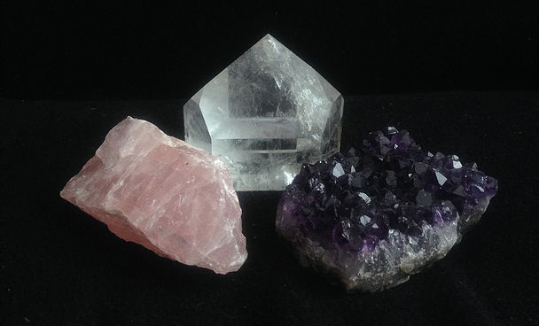

# Feng Shui

Feng Shui (letterlijk “wind en water”) is een oude Oosterse filosofie die leert dat de omgeving van groot belang is voor de harmonie van het individu. Het gaat over de relatie van de mens tot zijn leef- en werkomgeving.  Een storing hierin zoals bij voorbeeld slechte verlichting of slechte verluchting heeft effect op jezelf en je eigen welbevinden. Storende invloeden worden opgezocht, indien mogelijk verwijderd, anders terug in evenwicht gebracht door allerlei correcties. De volledige leer van Feng Shui schrijft voor hoe de leef - en werkruimtes in te richten zodat er optimale energiestroom is. Ik beperk me tot correcties door middel van minerale gesteenten.

De behandelruimte is volledig geoptimaliseerd volgens deze wetten, zodat je tijdens de sessie niet alleen het effect van de behandeling zelf ervaart, maar ook de harmonie van de gehele ruimte. Zo werkt de behandeling zo direct en zuiver mogelijk. 
 
Indien we na een gesprek of onderzoek merken dat er in jouw omgeving correcties dienen te gebeuren, dan ontleden we samen de storingen en geef ik je graag concreet advies.

