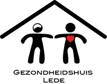
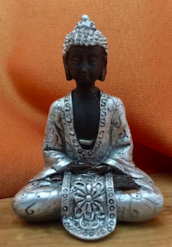

# GezondheidshuisLede

Vanaf **3 juni** kan je mij ook vinden in Lede, in het [**Gezondheidshuis**](https://gezondheidshuislede.be), Rammelstraat nr 10.

Voor het ogenblik alleen op **woensdagnamiddagen van 13u30 tot 17u30**.  

De nadruk in Lede ligt op relax en wegwerken van fysieke stressklachten:  
+ korte stoelmassages (30 min - 30 €) voor hoofd/nek/schouder klachten  
+ voetreflexologie, ontspannende voet massage (45 minuten - 50 €)   
+ een uur meditatie van 16u00 tot 17u00 (10 € per persoon).  

De zeer doorgedreven analyse voor Shiatsu/ Stress Coaching blijft momenteel alleen in Wetteren.  

Welk voordeel biedt Lede nog? Het is een multidisciplinair team waar je o.a. ook een psycholoog vindt, een TaPasCoach,… . De bedoeling is het team verder uit te bouwen met nog andere aanvullende disciplines. Ken je misschien iemand die ons team wil aanvullen? Laat het ons weten!  

Boekingen voor Lede gebeuren op dezelfde manier als in Wetteren.  
Het aanbod in Wetteren blijft tegelijkertijd lopen gelijk je gewend bent; dus je hebt eenvoudigweg meer keuzemogelijkheid!

Om iedereen te leren kennen en ook het huis al eens te bezichtigen, wordt er een **opendeurdag** 
georganiseerd: **vrijdag 24 mei vanaf 19u** ben je welkom om een kijkje te komen nemen en met de teamleden in gesprek te gaan. Nodig gerust iedereen, van wie je vindt dat ze er baat bij hebben, uit om mee te komen!

Wie langskomt, zijn email adres achterlaat in het daarvoor bestemde doosje, en Manopura liked op Facebook, maakt kans om dit klein fraai boeddha beeldje te winnen (5,5 cm hoog)!

