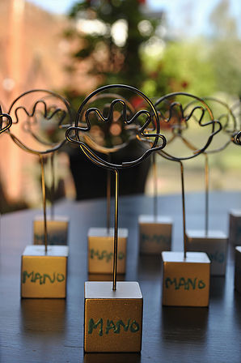

# **!!!NIEUW!!!   Start2Meditate** programma
Leren mediteren en hoe het kan helpen in de oplossing van je stress perikelen.

Vanaf 7 november 2018

Kijk voor meer info in de rubriek Aanbod/ Meditatie 

# Waar staat Manopura voor?

Mano pura betekent letterlijk in het Italiaans **"zuivere hand"**. Beide woorden hebben hun diepere betekenis:
 
De **hand** (mano) omdat de Shiatsu en Reiki behandelaar hoofdzakelijk zijn handen gebruikt. De hand heeft ook een grote symbolische waarde: een helpende hand, een beschermende hand, een verzorgende hand.
 
Onder de definitie van **zuiver** (pura), verstaan we o.a. puur, helder, schoon, niet vermengd met iets wat er niet bij of in hoort... Het spreekt voor zich dat de behandelaar zelf zuiver en in balans hoort te zijn alvorens hij een behandeling adequaat kan uitvoeren. Daarenboven wordt tijdens een behandeling getracht alle onzuiverheden uit het systeem weg te werken.

De term manopura doet wellicht ook denken aan manipura, die dan weer verwijst naar de derde chakra of energiecentrum, de zonnevlecht. Deze heeft te maken met je kracht, de drijfveer om vorm te geven aan je leven.

Kort gezegd: alles wat je tegenhoudt om jezelf te (kunnen) zijn zoals stress, ziekte, ongemak, blokkades,... tracht ik aan te pakken via complementaire behandelingswijzen om zo ervoor te zorgen dat de zon terug in je leven kan schijnen en je weer jezelf wordt in de zuiverste zin.
​
Manopura is lid van de Belgische Shiatsu Federatie.

<iframe width="560" height="315" src="https://youtu.be/mqQqY05ojO8" frameborder="0" allow="autoplay; encrypted-media" allowfullscreen></iframe>
