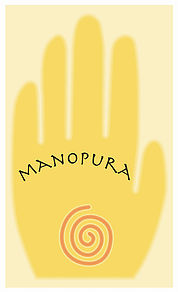
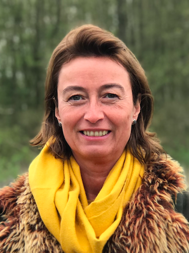
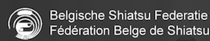
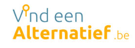

# Waar staat Manopura voor?

Mano pura betekent letterlijk in het Italiaans **"zuivere hand"**. 
De behandelaar werkt met de handen, om (stress) klachten aan te pakken of spanningen uit het lichaam te helpen verzachten en oplossen.

Maar Manopura is meer dan een lichamelijke behandeling; het gaat veel dieper; er wordt ingezoemd op alles wat eventueel in je omgeving stress veroorzaakt, en dat kan gaan van het soort werk dat je doet, de relaties rondom je, je brede leefomgeving, emoties die je parten spelen; ja, zelfs je voeding!

Coachend leer je aan hoe met die verschillende stressoren om te gaan.
Manopura staat erom bekend om door te zoeken naar de "root cause", de dieperliggende oorzaak van waar het probleem precies ooit begonnen is. Want je wil niet telkens met je (lichamelijke) klachten hervallen!
Daarom krijg je persoonlijke begeleiding, volledig op jouw maat en afgestemd op jouw noden, in een warme en begripvolle omgeving, discreet en professioneel, zonder zweverige blabla.

# Wie ben ik?

   

Ik ben Marian De Lathauwer, afgestudeerd als Licentiate in de Romaanse Taal- en Letterkunde, en meteen nadien het bedrijfsleven ingedoken. Gelijktijdig daarmee, volgde ik vele cursussen in o.a. mindfulness, heart-fulness, relaxatie, ademhalingstechnieken, stress coach, muziek, yoga, QiGong, oude healingsmethoden, emotioneel lichaamswerk, EFT, basis anatomie en pathologie, en een doorgedreven opleiding Shiatsu en Voetreflexologie.   
Ik startte Manopura op in 2016, vanuit mijn zielsmissie om mensen te helpen bij de uitdagingen in hun leven. De kennis van enerzijds de harde business-wereld en anderzijds de 'soft skills' van energetisch werk, zie ik als een enorm voordeel. Het biedt me unieke combinatie-mogelijkheden en verschillende invalshoeken om een situatie te bekijken.   

Wanneer je als **particulier** bij mij een afspraak boekt, begin ik traditioneel met een intake gesprek, om jouw situatie goed te begrijpen. Ik werk namelijk zowel op lichaam (via Shiatsu, Voetreflexologie, Reiki, Yoga, QiGong) als op geest (coaching, oude healing methoden, meditatie). Het lichaam zelf speelt een cruciale rol, omdat pijn en ongemak altijd een vertaling zijn van wat daar precies aan de basis van ligt. Plus ons denkvermogen wordt toch al te veel belast, en het lichaam al te veel verwaarloosd.

De sessies zijn interactief; jouw medewerking is vereist, zoals bij voorbeeld met oefeningen die ik meegeef om thuis verder te doen. Het beste resultaat wordt bereikt wanneer jezelf ook verantwoordelijkheid opneemt.

Eigenlijk fungeer ik als een soort vertaler-tolk van de signalen van je lichaam (en geest), waarmee ik je help begrijpen waar de oorzaak ligt en hoe je ermee aan de slag kan.

Mijn grote voordeel is dat ik logisch - analytisch sterk ben, als hoogsensitief persoon ook meteen aanvoel wat er speelt en pragmatisch van aanpak ben.     

Stress is trouwens altijd deel van mijn leven geweest. Opgroeien in de onvoorspelbare en onbetrouwbare wereld van narcisme; eens het huis uit een boeiende maar stressvolle internationale carrière van ruim 20 jaar; doe daar een persoonlijke rijke interessesfeer, leergierigheid en enthousiasme bij, en je hebt de perfecte mix voor een zware burn-out... zeker als je moeilijk "neen" kan zeggen tegen anderen, en jezelf wegcijfert. Dus ik moest voor mezelf op zoek naar methoden die mij konden ondersteunen, om zowel lichamelijk als geestelijk de druk het hoofd te kunnen blijven bieden. Deze rijke bron aan eigen levenservaringen vormt de basis voor wat ik jou kan aanrijken om jou doorheen jouw levensprocessen te begeleiden.    
  
Voor **bedrijven** ga ik soortgelijk te werk. Samen met de CEO, preventie-adviseur of de HR-verantwoordelijke brengen we in kaart waar we dienen aan te werken. Mijn aanbod is divers: korte stoelmassages voor het personeel om lichamelijke klachten aan te pakken; in-house opleidingen om beter met de werkdruk om te leren gaan; begeleidingstrajecten als welzijnscoach in de strijd tegen langdurig absenteïsme en burn-outs,...

# Missie  

Ik wil een helpende hand bieden aan al wie   
+ rust zoekt
+ over-stressed of overprikkeld is
+ lichamelijke (stress)klachten heeft
+ inzicht wil krijgen in de oorzaak ervan en hoe het het beste aan te pakken.  

Ik begeleid je op je zoektocht door het leven, en maak er graag tesamen een boeiende ontdekkingstocht van.   
Ik help je ontdekken  
+ hoe je eigen lichaam werkt
+ hoe emoties het lichaam beinvloeden
+ welke impact het denken op emoties heeft, en dus ook op het lichaam

Ik streef naar  
+ een mens in harmonie
+ die zelf-bewust is
+ die intuïtief leeft 
+ met hart en denkvermogen in balans

# Voor wie kan Manopura iets betekenen?

Voor elk individu, mens, klant, patiënt:    
+ met steeds terugkerende (lichamelijke) klachten   
+ die klinisch onderzocht is, maar waar geen medische oorzaak voor het ongemak werd gevonden   
+ met chronische stress en burn-out vòòr wil blijven   
+ in burn-out, die terug energie wil herwinnen   
+ hoogsensitieve mensen (HSP) en HSS (High Sensation Seeker)   
+ op zoek naar diepgang, die intuïtief weet dat er meer is, en daarin begeleiding zoekt   
+ die bereid is aan zichzelf te willen werken   

Voor elke CEO, preventie-adviseur, HR-verantwoordelijke:
+ die het beste voor heeft met het personeel
+ die proactief werkt aan het welzijn van de medewerkers en beleid voert tegen langdurig absenteïsme en burn-out   
+ die oog heeft voor ergonomie, werkdruk, fysieke en mentale belasting

---  

Volg ons op [**LinkedIn**](https://www.linkedin.com/in/manopura-shiatsu-stress-coaching-mindfulness-01b965172), [**MeWe**](https://mewe.com/p/manopura-komtotrust-mariandelathauwer) en op het [**Complementaire gezondheidszorg**](https://t.me/complementaire_gezondheidszorg) channel van Telegram  voor het laatste nieuws!    

---

  
Manopura is lid van de Belgische Shiatsu Federatie. Sinds november 2021 ben ik lid van de Raad van Bestuur.

