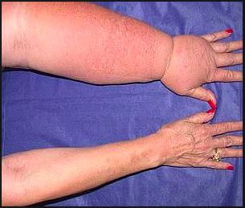

# Manuele lymfdrainage

Het menselijk lichaam bestaat voor 2/3 deel uit vocht. Het lichaam is in een optimaal evenwicht als de waterhuishouding in een optimale conditie verkeert. Het lymfstelsel (lymfvaten en lymfknopen) speelt een belangrijke rol bij het scheppen en onderhouden van de ideale leefomgeving voor onze lichaamscellen. Het is namelijk de lymfe die daar een voedende, zuiverende en drainerende rol vervult.

Lymfdrainage is dus een normale, natuurlijke functie in ons lichaam. Deze functie kan echter bemoeilijkt worden als gevolg van een ongeval, ziekte of stress. In dit geval kan de drainage van de lymfe manueel (met de handen) geoptimaliseerd worden.

De manuele lymfdrainage is een druk en pomptechniek die erop gericht is het lymfstelsel te stimuleren. Deze stimulatie is nodig om het teveel aan vocht (zichtbaar en onzichtbaar oedeem) beter c.q. sneller via de lymfbanen af te voeren. In 1932 ontwikkelde Dr. Emil Vodder, een Deens bioloog, samen met zijn echtgenote, een voor die tijd revolutionaire therapie.

Het bijzondere van de therapie van Dr. Vodder is dat die niet alleen gericht is op de drainerende werking van het lymfstelsel maar vooral op de voedende en zuiverende werking van al het lichaamsvocht.

De Manuele Lymfdraniage volgens de methode Vodder is op het gehele lichaam toepasbaar. Ze heeft als doel de vochtdoorstroming te stimuleren en eventuele stagnaties op te heffen, de immuniteit (weerstand) te verhogen, de stress te verlagen en het hormonale stelsel te optimaliseren. De waterhuishouding wordt direct beïnvloed door de stimulatie van het lymfsysteem en indirect door het dempen van het verhoogd stressniveau in het lichaam.

**Behandelbare klachten:**

* zwellingen (oedeem)
* verstuikingen
* bloeduitstortingen
* spierpijnen of spierletsels
* dystrofieën
* klachten als gevolg van stress
* slapeloosheid
* concentratieverlies
* constipatie
* hoofdpijn

