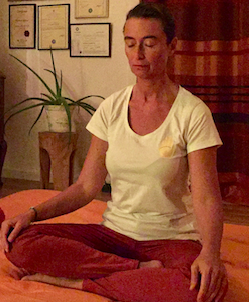

# Meditatie

Er wordt mogelijkheid geboden in kleine groepjes te leren mediteren. 
Mensen die graag kennis maken met wat mediteren precies is, en willen oefenen onder begeleiding, zijn van harte welkom.
We hebben een Start2Meditate programma!

**Waarom?**
Tijdens de behandelingen in mijn praktijk zie ik meer en meer mensen worstelen met stress, wegens uiteenlopende redenen. Iedereen lijkt op zoek te zijn naar de juiste manier om te ontspannen, die voor hem/haar werkt . Wèrkelijk ontspannen, rust ervaren, het hoofd leegmaken. Maar men weet niet hoe. Sport? Uitgaan? Hobbies? … 
Op zich zijn deze waardevol, maar het lichaam zelf komt niet (genoeg) tot rust, het blijft steeds actief. 
Hoe maak je je hoofd leeg? Hoe ga je om met steeds terugkerende zorgen en spanning? 

Meditatie is daarvoor één van de meest geschikte manieren, maar hoe doe je dat (goed)? Wat houdt mediteren precies in? Misschien heb je een extra motivator nodig om op te starten of te herstarten. Daarom zijn er vanaf nu deze geleide meditatie sessies.

**Voor wie?**
* Voor al wie niet weet wat mediteren precies inhoudt, en ermee kennis wil maken
* Voor al wie reeds van mediteren gehoord heeft, maar niet precies weet hoe er zelf mee te starten
* Voor al wie reeds meditatie ervaring heeft, en graag in een kleine groep extra oefening en begeleiding krijgt
* Voor al wie vroeger reeds gemediteerd heeft, en de draad terug wil oppakken.

**Wat houdt het in?**
* 1 uurtje in de week samen komen, in een groepje van maximaal 6 personen
* een inleiding met duiding en uitleg telkens over een ander facet van mediteren
* de meditatie zelf die begeleid wordt, stap voor stap
* nabespreking, bij een heerlijk vers kopje thee
* wekelijkse oefening zelfde dag zelfde uur.

**Praktisch**
* Wekelijks, op woensdagavond om 20u in de praktijkruimte van Manopura
* Bijdrage: 10 € per sessie, contant te betalen de avond zelf; 
* Mogelijkheid om in te tekenen voor een 10 weken programma (95€ -> 5€ korting!) 
* Wie meditatie kussens, poef, matje heeft, mag die meebrengen. Er is zowiezo wel een poef en een matje voorzien.

**Registreren noodzakelijk**: via de Facebook pagina van Manopura https://www.facebook.com/pg/manopura/events/?ref=page_internal

of stuur ons een mailtje marian@manopura.be

