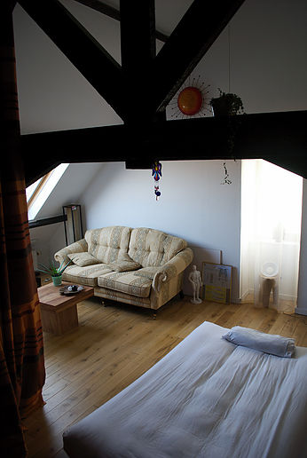

# Praktisch & Agenda
### Voor Particulieren:
### Prijslijst:

**De prijzen worden per 1 juli 2022 aangepast. Dan komt er 5 euro bij per behandeling.**
 
Stress coaching & Shiatsu behandeling    
(eerste keer is met intake gesprek)   
60 min - 60 euro  
75 min - 75 euro   
90 min - 90 euro 

Shiatsu stoel nek-, schouders-, rugmassage:   
30 min - 40 euro

Shiatsu ontspanningsmassage (zonder analyse, zonder intake)   
45 min - 50 euro   

Voetreflexologie:   
45 min - 50 euro  
60 min - 65 euro  
75 min - 80 euro

Reiki:   
60 min - 60 euro  
90 min - 90 euro

Yoga privé-les:   
30 min - 30 euro   
45 min - 45 euro   
60 min - 60 euro   

**Groepslessen**:   
**Meditatie**      
60 min - 12 euro per persoon  
Gelieve uw aanwezigheid te bevestigen op marian@manopura.be    
Deze groepsles gaat door in de praktijkruimte van Manopura.   

**5 elementen Yoga**   
75 min - 12 euro per persoon   
Gelieve uw aanwezigheid te registreren via de agenda op de website van [**Polikliniek Rode Heuvel**](https://www.polikliniek-rodeheuvel.be).       
Deze groepsles gaat door in de polyvalente ruimte van Polikliniek Rode Heuvel.   

Prijs cursussen: zie [**cursussen**](http://www.manopura.be/cursussen.html)

---

### Agenda

**Yoga lessen in de Polikliniek Rode Heuvel**: elke donderdag, 19u00 - 20u15. Per les: 12 €. Geen voorkennis vereist. Vooraf inschrijven noodzakelijk. OOK tijdens schoolvakanties!   

**Mindfulness 8-weekse opleiding in de Polikliniek Rode Heuvel**: nieuwe reeks vanaf donderdag 15 september 17u30-20u. Voor de 8 lessen van 2,5 uur: 300€. Geen voorkennis vereist. Vooraf inschrijven noodzakelijk.   

**Reiki 1 opleiding en inwijding**: zaterdag 29 oktober 10-18u in de praktijk van Manopura. Voor de hele dag, cursusmateriaal en lunch: 150€   

**Reiki2 opleiding en inwijding**: zaterdag 27 aug 10u - 18u in de praktijk van Manopura. Voor de hele dag, cursusmateriaal en lunch: 150€    

**OpenReiki oefenmoment** in groep met andere mensen die al dan niet een Reiki graad hebben. Samenkomen, ervaringen delen, vragen stellen, bijleren,... 23 augstus om 19u. Inkom gratis, of vrije bijdrage.    

**Open Meditatie**: 6 juli 19u30; 24 augustus 19u30. Inkom gratis, of vrije bijdrage.   

---

### Praktisch  

+ Betaling kan zowel cash als electronisch via een BanContact app op de smartphone.  

+ Sommige mutualiteiten komen gedeeltelijk tussen in de kosten.   
Gelieve u daarover te informeren.

+ Wanneer de afspraak de dag zelf, of tot 24u voordien wordt afgebeld of gevraagd wordt te verplaatsen, wordt de sessie wel aangerekend. Ook wanneer men niet komt opdagen zonder te verwittigen. Met dank voor het begrip!

+ De behandeling gebeurt in gemakkelijk zittende kledij, van zo natuurlijk mogelijk materiaal, dat soepel meegeeft met de verschillende stretch bewegingen. Liever dus een loszittende linnen broek dan een strakke jeans. Dames dragen beter geen sieraden, nylonkousen of rok.

+ Er is een aparte omkleedruimte voorzien.

+ Hou er rekening mee dat de behandelruimte op de bovenverdieping is, dus er dienen trappen genomen te worden.

   

Volgende **corona veiligheidsmaatregelen** zullen gehanteerd worden:

Houdt u aan de hoest-en niesetiquette.     
De massagestoel wordt na elke klant ontsmet.     
De behandelruimte wordt na of indien nodig tijdens elke klant extra geventileerd. Er is een CO2 meter.   
Kom op de voorziene tijd van uw afspraak; indien u te vroeg bent, wacht in uw auto of buiten. De wachtkamer wordt momenteel niet gebruikt.   
Voelt u zich ziek of iemand van uw huisgenoten is ziek, doe een (speeksel)test. Indien positief, annuleer dan schriftelijk de afspraak met het bewijs van uw positieve test. Is de test negatief, kom alsnog. Dan werken we verder op de versterking van uw immuunsysteem, of wat ook de mogelijke oorzaak kan zijn van uw ongemak.      
Heeft u hierover nog verdere vragen, stel ze gerust!   

### Voor Bedrijven:
 
Door het aanbieden van Shiatsu op het werk, of de aanwezigheid van een stresscoach, toont u als werkgever uw actieve betrokkenheid bij de gezondheid en het welzijn van uw werknemers. Zij ervaren dit als een positieve en gezonde investering. Shiatsu draagt bij tot een hogere motivatie, betere prestaties en een prettige werksfeer.
 
De massage maakt de spieren los en zorgt ervoor dat de gebieden die het meeste te lijden hebben onder werkstress of een verkeerde houding zich kunnen herstellen. In een behandeling van een half uur worden rug, nek, schouders, armen en handen gemasseerd. Ook hier wordt bovenop de kleren gewerkt.
Hierna voelt uw werknemer zich ontspannen en kan energiek het werk hervatten. Regelmatige massages stellen uw werknemer beter in staat om naar zijn eigen lichaam te luisteren en stress te voorkomen.
 
Tijdens een eerste kennismaking op uw bedrijf, bepalen we het algemeen kader waarin u het beste het welzijn van uw werknemers kan aanpakken: via (eventueel een combinatie van) een shiatsu behandeling, ontspanningsoefeningen, coaching of andere stress begeleiding. We kijken samen na hoe we uw ruimte optimaal kunnen benutten. Is er plaats genoeg om een futon (behandelmat) te leggen, of wordt het eerder de massagestoel. Een tijdsschema wordt opgesteld. In overleg werken we de beste formule uit.
