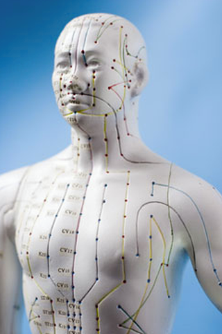
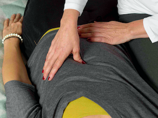
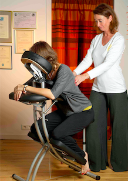
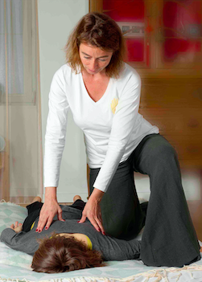

# Shiatsu

"Shiatsu (Japans voor vinger-druk)  is een vorm van manipulatie met duimen, vingers en handpalmen, waarmee, zonder gebruik van enig instrument, druk wordt uitgeoefend op de menselijke huid, om interne stoornissen te corrigeren, de gezondheid te bevorderen of te bewaren, en specifieke problemen te behandelen." *(Definitie van Shiatsu volgens het Japanse Ministerie van Gezondheid)*

In de Oosterse Geneeskunde is de belangrijkste oorzaak van ziekte het stagneren (niet meer stromen) van Ki of levensenergie. Dit wordt veroorzaakt door een verstoring van het evenwicht tussen de mens en zijn omgeving, tussen geest en lichaam, tussen ortho- en parasympatisch zenuwstelsel. Voorbeeld: je kent zeker het verschil tussen hoe je je "goed in je vel" voelt en alles als vanzelf lijkt te gaan, en anderzijds wanneer je je geblokkeerd voelt en alles tegenzit. Wanneer het lichaam of de geest signalen sturen van pijn of ongemak, is het nodig deze signalen aan te voelen, te onderzoeken waar ze vandaan komen, de oorzaken aan te pakken of er anders mee leren omgaan, liefst in een zo vroeg mogelijk stadium alvorens het ongemak groter wordt en zich verder als ziekte manifesteert. Vandaar dat Shiatsu zowel preventief als remediërend kan worden toegepast. 
 
Shiatsu kan helpen bij tal van klachten. Tegenwoordig zijn stress gerelateerde klachten veel voorkomend: nek- en schouderpijn, lage rugpijn, ademhalingsmoeilijkheden, spijsverteringsklachten, overprikkeling, slecht slapen, burn-out...

Door druk te geven op de juiste  spanningspunten in het lichaam lost de stagnatie op en treedt automatisch het zelf-regulariserend systeem van het lichaam in werking en wordt het uitgenodigd een nieuw, beter evenwicht te zoeken. Een Shiatsu behandeling werkt ontspannend en vitaliserend.
Naast Shiatsu zijn evenwichtige voeding, correcte ademhaling, lichaamsbeweging en positief denken de pijlers van een gezonde geest in een gezond lichaam. Graag geef ik je hierover ook verder advies.

**Kostprijs**: lees meer onder de rubriek "Praktisch".

**Voetreflexologie** is deel van de Shiatsu opleiding. Mensen die graag van een volledige voetmassage genieten, kunnen daarvoor ook bij mij terecht! Lees meer onder "Aanbod/ Voetreflexologie".

