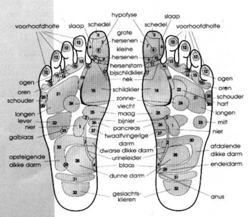
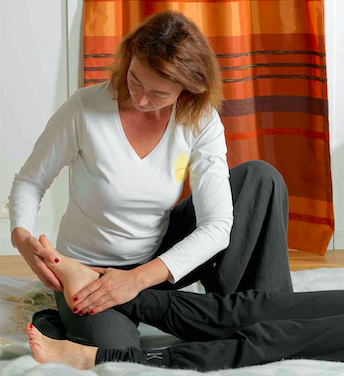

# Voetreflexologie 

Wat is er heerlijker dan te genieten van een relaxerende massage van de voeten? je voelt je meteen daarna herboren, vol energie, en mogelijks is zelfs hier en daar een pijnlijk plekje op de voeten wel weggewerkt!

Wat maakt voetreflexologie anders dan een gewone voet massage?

Volgens de voetreflexologie staan bepaalde zones op de voet in verbinding met delen van de rest van het lichaam.
Het is mogelijk dat er in de voet bepaalde afzettingen ontstaan (kalk, lymfevocht, urinezuurkristallen, …); dan is het interessant na te gaan in welke zones zich dat precies voordoet en welk het corresponderende belaste orgaan is (bij voorbeeld lever, als ontgiftingsorgaan vaak overbelast) 

Worden die bepaalde zones in de voet gemasseerd, dan werkt dit ook door op het gelinkte orgaan. Doel is uiteindelijk om ontspanning en rust te creëren en het lichaam terug in evenwicht  te brengen.

Contra-indicaties: 
* Bij schimmels op de voet en gangreen
* Bij acute ontstekingen
* Bij zwangerschappen met risicofactoren

Een voetreflexbehandeling werkt zeer ontspannend en je kan kiezen hoeveel tijd pure relax je jezelf wil gunnen:

1 uur: 60 euro
1,5 uur: 90 euro
